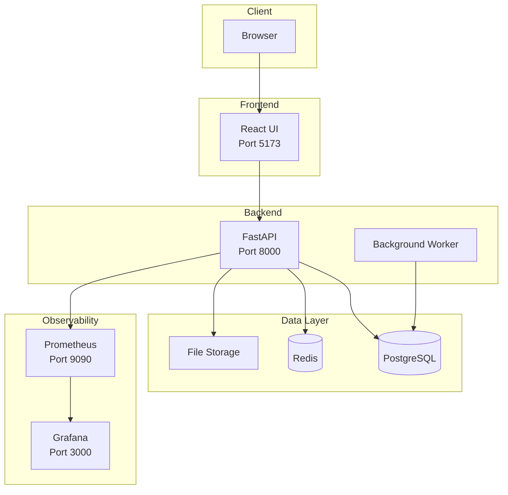

# Task Tracker – Technical Assessment

This repository contains the implementation of the Task Tracker application for the Full Stack Developer technical assessment.

## Table of Contents

- [Task Tracker – Technical Assessment](#task-tracker--technical-assessment)
  - [Table of Contents](#table-of-contents)
  - [📋 Quick Links](#-quick-links)
    - [🚀 Services \& Endpoints](#-services--endpoints)
    - [📚 Documentation](#-documentation)
      - [Core Documentation (`docs/`)](#core-documentation-docs)
      - [Backend Documentation (`backend/docs/`)](#backend-documentation-backenddocs)
      - [Frontend Documentation (`frontend/docs/`)](#frontend-documentation-frontenddocs)
      - [Project Management (`agentic-sdlc/`)](#project-management-agentic-sdlc)
  - [🚀 Quick Start](#-quick-start)
    - [Option 1: Docker Compose (Recommended)](#option-1-docker-compose-recommended)
    - [Option 2: Manual Setup](#option-2-manual-setup)
  - [🏗️ Architecture](#️-architecture)
  - [📜 Scripts](#-scripts)
  - [🗄️ Database Management](#️-database-management)
  - [🌱 Seeding Sample Data](#-seeding-sample-data)
  - [🧪 Running Tests](#-running-tests)
  - [📖 Documentation Structure](#-documentation-structure)
    - [Core Documentation (`docs/`)](#core-documentation-docs-1)
    - [Backend Documentation (`backend/docs/`)](#backend-documentation-backenddocs-1)
    - [Project Management (`agentic-sdlc/`)](#project-management-agentic-sdlc-1)
  - [🔍 Key Features](#-key-features)
  - [🛠️ Technology Stack](#️-technology-stack)
  - [📊 Project Status](#-project-status)
  - [📝 Project Backlog \& Workflow](#-project-backlog--workflow)
  - [🔐 Default Credentials](#-default-credentials)
  - [📞 Support \& Resources](#-support--resources)

## 📋 Quick Links

### 🚀 Services & Endpoints

**Application Services:**
- **Frontend UI**: http://localhost:5173
- **Backend API**: http://localhost:8000
- **API Documentation (Swagger UI)**: http://localhost:8000/docs
- **API Documentation (ReDoc)**: http://localhost:8000/redoc
- **OpenAPI JSON**: http://localhost:8000/openapi.json

**Observability Services:**
- **Prometheus**: http://localhost:9090
- **Grafana**: http://localhost:3000 (default: `admin` / `admin`)
- **API Metrics**: http://localhost:8000/api/metrics
- **Health Check (API)**: http://localhost:8000/api/health/api
- **Health Check (Database)**: http://localhost:8000/api/health/database
- **Health Check (Worker)**: http://localhost:8000/api/health/worker

**Infrastructure Services:**
- **PostgreSQL Database**: Internal Docker network only (use pgAdmin to access)
- **Redis**: `localhost:6379`
- **pgAdmin (Database Web UI)**: http://localhost:8888 (default: `admin@example.com` / `admin`)

### 📚 Documentation

#### Core Documentation (`docs/`)
- **[Requirements](docs/requirements.md)** - Original assignment (source of truth)
- **[Technical Specs](docs/technical-specs.md)** - Structured restatement of requirements
- **[Architecture](docs/architecture.md)** - System architecture, design patterns, and rationale
- **[Technology Stack](docs/technology.md)** - Technology decisions and rationale
- **[Self-Assessment](docs/self-assessment.md)** - Completion status, design choices, and trade-offs
- **[Suggestions](docs/suggestions.md)** - Optional best practices
- **[Docker Setup](docs/docker.md)** - Docker setup guide

#### Backend Documentation (`backend/docs/`)
- **[API Documentation](backend/docs/api.md)** - Swagger/OpenAPI usage guide (all endpoints documented in `/docs` and `/redoc`)
- **[Database Access](backend/docs/database-access.md)** - Database connection, pgAdmin web UI, and seed script
- **[Testing](backend/docs/testing.md)** - Backend testing guide

**Feature-Specific Documentation:**
- **[Authentication Design](backend/docs/auth-design.md)** - JWT authentication architecture
- **[Authorization](backend/docs/authorization.md)** - Authorization guards and permissions
- **[Task Model](backend/docs/task-model.md)** - Task model implementation
- **[Attachment Design](backend/docs/attachments.md)** - Attachment storage and security
- **[Search & Filter API](backend/docs/search-filter-api-design.md)** - Search/filter implementation notes
- **[Tag Filtering](backend/docs/tag-filtering.md)** - Tag matching implementation
- **[Audit Trail](backend/docs/audit.md)** - Audit trail query and action types
- **[Rate Limiting Design](backend/docs/rate-limiting-design.md)** - Rate limiting implementation
- **[Monitoring Usage](backend/docs/monitoring-usage.md)** - How to access logs and metrics
- **[Grafana](backend/docs/grafana.md)** - Metrics dashboards
- **[Worker](backend/docs/worker.md)** - Background worker implementation

#### Frontend Documentation (`frontend/docs/`)
- **[Task 10 Review](frontend/docs/task-10-review.md)** - Frontend implementation review
- **[E2E Tests README](frontend/tests/e2e/README.md)** - Playwright E2E test documentation

#### Project Management (`agentic-sdlc/`)
- **[AWP (Agentic Workflow Protocol)](agentic-sdlc/AWP.md)** - Workflow protocol for task management
- **[Project Backlog](agentic-sdlc/project-backlog.md)** - Main backlog index with all tasks
- **[Backlog README](agentic-sdlc/README.md)** - Backlog structure and usage guide

## 🚀 Quick Start

### Option 1: Docker Compose (Recommended)

**Prerequisites:**
- Docker and Docker Compose installed

**Quick Start:**
```bash
cp .env.example .env  # Set JWT_SECRET_KEY (min 32 chars)
npm run docker:init   # Clean start with auto-setup
```

**Automatic Setup:**
On first startup, Docker automatically:
- Creates database schema
- Creates test user: `testuser` / `testpassword`
- Seeds 50 sample tasks

**Access:**
- Frontend: http://localhost:5173
- API: http://localhost:8000
- API Docs: http://localhost:8000/docs
- Grafana: http://localhost:3000 (admin/admin)
- pgAdmin: http://localhost:8888 (admin@example.com/admin)

**Commands:**
```bash
npm run docker:up      # Start all services
npm run docker:down    # Stop all services
npm run docker:logs    # View logs
npm run docker:creds   # Show test user credentials
```

**Full Documentation:** See [Docker Setup Guide](docs/docker.md) for details.

### Option 2: Manual Setup

**Start Backend:**
```bash
npm run start:backend
```
Or manually:
```bash
cd backend
source .venv/bin/activate  # On macOS/Linux
uvicorn api.main:app --reload
```

**Start Frontend:**
```bash
npm run start:frontend
```
Or manually:
```bash
cd frontend
npm run dev
```

**Start Both (requires two terminals):**
```bash
# Terminal 1 - Backend
npm run start:backend

# Terminal 2 - Frontend  
npm run start:frontend
```

The backend will be available at **http://localhost:8000** and the frontend at **http://localhost:5173**.

## 🏗️ Architecture



**Clean Architecture Layers:**
- **Domain Layer**: Core business logic and entities
- **Application Layer**: Use cases and business rules
- **Infrastructure Layer**: Database, storage, external services
- **API Layer**: FastAPI routes and middleware

See [docs/architecture.md](docs/architecture.md) for detailed architecture documentation.

## 📜 Scripts

**Docker:**
```bash
npm run docker:init    # Clean start + show credentials
npm run docker:up      # Start services
npm run docker:down     # Stop services
npm run docker:logs     # View logs
npm run docker:creds    # Show test user credentials
```

**Development:**
```bash
npm run start:backend   # Start backend
npm run start:frontend  # Start frontend
npm run install:backend # Setup backend
npm run install:frontend # Setup frontend
```

**Database:**
```bash
npm run seed           # Seed sample tasks
npm run user:create    # Create user (args: username email password)
npm run audit:query    # Query audit events
```

**Testing:**
```bash
npm run test:backend   # Backend tests
npm run test:e2e       # E2E tests
npm run test:e2e:ui     # E2E tests (UI mode)
npm run test:e2e:headed # E2E tests (headed mode)
```

## 🗄️ Database Management

The project includes **pgAdmin** (web UI) for database management and supports command-line access.

**Quick Access:**
- **pgAdmin Web UI**: http://localhost:8888 (login: `admin@example.com` / `admin`)
- **Console Access**: `docker exec -it task-tracker-db psql -U tasktracker -d task_tracker`

**Connection Details:**
- Host: `database` (from Docker network) or `localhost` (from host)
- Port: `5432`
- Database: `task_tracker`
- Username: `tasktracker`
- Password: `changeme`

See **[Database Access Guide](backend/docs/database-access.md)** for:
- Complete pgAdmin setup and usage instructions
- Console/command-line database access
- SQL query examples
- Data export/import
- All database management operations

## 🌱 Seeding Sample Data

To populate the database with sample tasks for testing:

**Using Docker Compose:**
```bash
# Create 50 tasks for seed_user (default)
docker exec task-tracker-api python scripts/seed_tasks.py

# Create custom number of tasks for a specific user
docker exec task-tracker-api python scripts/seed_tasks.py --count 50 --user-id 1
```

**Using Manual Setup:**
```bash
cd backend
source .venv/bin/activate
python scripts/seed_tasks.py --count 50 --user-id 1
```

**Using npm scripts:**
```bash
npm run seed  # Seed 50 tasks (default)
```

**Options:**
- `--count`: Number of tasks to create (default: 50)
- `--user-id`: User ID to assign tasks to (default: creates/uses `seed_user`)

The seed script creates tasks with varied statuses, priorities, due dates, and tags. See [backend/docs/database-access.md](backend/docs/database-access.md) for more details.

## 🧪 Running Tests

**Backend Tests:**
```bash
npm run test:backend
```
Or manually:
```bash
cd backend
source .venv/bin/activate
pytest tests/ -v
```

**E2E Tests (Playwright):**
```bash
# Run all E2E tests
npm run test:e2e

# Run with UI mode (interactive)
npm run test:e2e:ui

# Run in headed mode (see browser)
npm run test:e2e:headed
```

**Prerequisites for E2E tests:**
- Backend API running on `http://localhost:8000`
- Test user created: `testuser` / `testpassword`
- See [frontend/tests/e2e/README.md](frontend/tests/e2e/README.md) for detailed test documentation

## 📖 Documentation Structure

### Core Documentation (`docs/`)
```text
docs/
├── requirements.md              # Original assignment (source of truth)
├── technical-specs.md           # Structured restatement of requirements
├── architecture.md              # System architecture & design
├── technology.md                # Technology decisions & rationale
├── self-assessment.md           # Completion status & design choices
├── suggestions.md               # Optional best practices
└── docker.md                    # Docker setup guide
```

### Backend Documentation (`backend/docs/`)
```text
backend/docs/
├── README.md                    # Backend documentation index
├── api.md                       # Swagger/OpenAPI usage
├── database-access.md           # Database connection examples
├── testing.md                   # Backend testing guide
├── auth-design.md               # JWT authentication architecture
├── authorization.md             # Authorization implementation
├── task-model.md                # Task model implementation
├── attachments.md               # Attachment storage and security
├── search-filter-api-design.md  # Search/filter design
├── tag-filtering.md             # Tag matching implementation
├── audit.md                     # Audit trail query and action types
├── rate-limiting-design.md      # Rate limiting implementation
├── monitoring-usage.md          # Logs and metrics access
├── grafana.md                   # Metrics dashboards
└── worker.md                    # Background worker
```

### Project Management (`agentic-sdlc/`)
```text
agentic-sdlc/
├── AWP.md                       # Agentic Workflow Protocol
├── project-backlog.md           # Main backlog index
├── README.md                    # Backlog structure guide
└── tasks/
    ├── planned/                 # Planned task files
    └── unplanned/               # Unplanned task files
```

**Documentation Flow**:
```text
requirements.md (source)
    ↓
technical-specs.md (structured)
    ↓
architecture.md (design)
    ↓
technology.md (decisions)
    ↓
tasks/ (implementation)
```

## 🔍 Key Features

- ✅ **Authentication & Authorization**: JWT-based auth with password hashing
- ✅ **Task Management**: Full CRUD operations with ownership
- ✅ **Attachments**: File upload/download with metadata
- ✅ **Search & Filtering**: Title/description search, status/priority/tags/due date filters
- ✅ **Sorting & Pagination**: Multiple sort options with pagination
- ✅ **Background Worker**: Automated reminder notifications for due tasks
- ✅ **Audit Trail**: Complete audit logging for all operations
- ✅ **Rate Limiting**: Redis-based rate limiting
- ✅ **Monitoring**: Structured logging, metrics, health checks
- ✅ **Observability**: Prometheus + Grafana dashboards
- ✅ **Testing**: Unit, integration, worker, contract, observability, and E2E tests

## 🛠️ Technology Stack

- **Backend**: Python 3.11+, FastAPI, SQLAlchemy, PostgreSQL/SQLite
- **Frontend**: React 19, Vite, Tailwind CSS, React Router
- **Worker**: Python background scheduler
- **Database**: PostgreSQL (production) / SQLite (development)
- **Cache/Rate Limiting**: Redis
- **Observability**: Prometheus, Grafana
- **Testing**: Pytest, Playwright

See [docs/technology.md](docs/technology.md) for detailed technology decisions.

## 📊 Project Status

**All Tasks Complete:**
- ✅ Task 1: Project environment and documentation
- ✅ Task 2: Secure login and authorization
- ✅ Task 3: Task management API (CRUD)
- ✅ Task 4: Attachments API
- ✅ Task 5: Search, filtering, sorting, pagination
- ✅ Task 6: Notifications worker for due tasks
- ✅ Task 7: Audit trail implementation
- ✅ Task 8: Rate limiting
- ✅ Task 9: Monitoring, logging, health checks
- ✅ Task 10: React frontend
- ✅ Task 11: Testing and self-assessment

**Unplanned Enhancements:**
- ✅ U-1: Prometheus + Grafana observability dashboards
- ✅ U-2: Partial/substring tag matching in search
- ✅ U-3: UI smoke tests (E2E tests)

**Test Coverage:**
- ✅ 68 backend tests (unit, integration, worker, contract, observability)
- ✅ 10 frontend E2E tests (Playwright)

See [agentic-sdlc/project-backlog.md](agentic-sdlc/project-backlog.md) for complete task list.

## 📝 Project Backlog & Workflow

This project uses an **Agentic SDLC** approach with a structured backlog and workflow protocol:

- **Backlog**: See [agentic-sdlc/project-backlog.md](agentic-sdlc/project-backlog.md) for all planned tasks
- **Workflow**: See [agentic-sdlc/AWP.md](agentic-sdlc/AWP.md) for the Agentic Workflow Protocol (AWP)
- **Task details**: Individual task files in `agentic-sdlc/tasks/planned/` contain step-by-step implementation instructions

Tasks are organized hierarchically and follow the AWP workflow (`awp check`, `awp update`, `awp commit`, `awp next`, `awp handoff`) for consistent progress tracking and structured task management.

## 🔐 Default Credentials

**Grafana:**
- Username: `admin`
- Password: `admin` (change in production via `GRAFANA_PASSWORD` env var)

**Test User (for E2E tests):**
- Username: `testuser`
- Password: `testpassword`

Create test user:
```bash
npm run user:create testuser test@example.com testpassword
```
Or manually:
```bash
cd backend
.venv/bin/python3 scripts/create_user.py testuser test@example.com testpassword
```

## 📞 Support & Resources

- **API Documentation**: http://localhost:8000/docs (when API is running)
- **Backend README**: [backend/README.md](backend/README.md)
- **Frontend README**: [frontend/README.md](frontend/README.md)
- **Self-Assessment**: [docs/self-assessment.md](docs/self-assessment.md) - Complete project review
