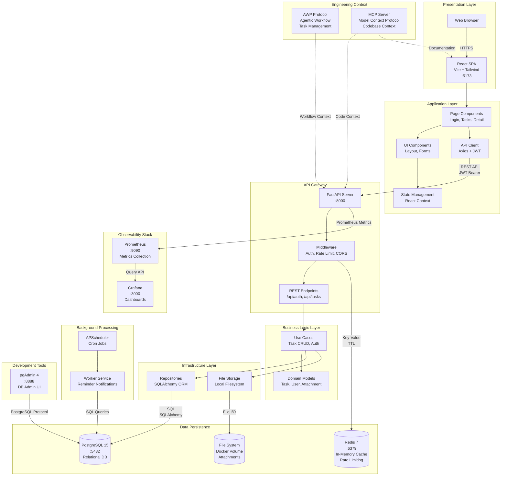

# Task Tracker – Full Stack Application

Full stack task management application with authentication, file attachments, search/filtering, background workers, and observability.

## Quick Start

### Docker

```bash
cp .env.example .env  # Set JWT_SECRET_KEY (min 32 chars)
npm run docker:init   # Clean start + auto-setup
```

**Auto-creates:** Test user (`testuser` / `testpassword`) + 50 sample tasks

**Access:** Frontend: <http://localhost:5173> | API: <http://localhost:8000> | Docs: <http://localhost:8000/docs>

### Manual

```bash
# Backend
npm run install:backend
npm run start:backend

# Frontend (new terminal)
npm run install:frontend
npm run start:frontend
```

## Architecture



**Service Access:**

- **Frontend**: <http://localhost:5173>
- **API**: <http://localhost:8000> | **Docs**: <http://localhost:8000/docs>
- **Prometheus**: <http://localhost:9090>
- **Grafana**: <http://localhost:3000> (admin/admin)
- **pgAdmin**: <http://localhost:8888> (login: `admin`@`example.com` / password: `admin`)

See [Architecture Documentation](docs/architecture.md) for details.

## Scripts

**Docker:**

```bash
npm run docker:init    # Clean start + show credentials
npm run docker:up      # Start services
npm run docker:down    # Stop services
npm run docker:logs    # View logs
npm run docker:creds   # Show test user credentials
```

**Development:**

```bash
npm run start:backend   # Start backend
npm run start:frontend  # Start frontend
npm run install:backend # Setup backend
```

**Database:**

```bash
npm run seed           # Seed sample tasks
npm run user:create    # Create user (args: username email password)
npm run audit:query    # Query audit events
```

**Testing:**

```bash
npm run test:backend   # Backend tests
npm run test:e2e       # E2E tests
```

## Documentation

**Component READMEs:**

- **[Backend README](backend/README.md)** - Backend setup, scripts, and documentation index
- **[Frontend README](frontend/README.md)** - Frontend setup and development guide

**Core Documentation (`docs/`):**

- **[Architecture](docs/architecture.md)** - System design and Clean Architecture
- **[Docker Setup](docs/docker.md)** - Docker guide
- **[Requirements](docs/requirements.md)** - Original assignment
- **[Technology Stack](docs/technology.md)** - Technology decisions
- **[Self-Assessment](docs/self-assessment.md)** - Project review

**Backend Documentation (`backend/docs/`):**

- **[API Documentation](backend/docs/api.md)** - Swagger/OpenAPI endpoints
- **[Testing](backend/docs/testing.md)** - Testing guide
- **[Database Access](backend/docs/database-access.md)** - Database management
- See [Backend README](backend/README.md) for complete index

**Frontend Documentation (`frontend/docs/`):**

- **[E2E Tests](frontend/tests/e2e/README.md)** - Playwright test documentation
- See [Frontend README](frontend/README.md) for complete index

**Project Management (`agentic-sdlc/`):**

- **[AWP](agentic-sdlc/AWP.md)** - Agentic Workflow Protocol
- **[Project Backlog](agentic-sdlc/project-backlog.md)** - Task backlog

## Services & Endpoints

**Application:**

- Frontend: <http://localhost:5173>
- API: <http://localhost:8000>
- API Docs: <http://localhost:8000/docs>

**Observability:**

- Prometheus: <http://localhost:9090>
- Grafana: <http://localhost:3000> (admin/admin)
- pgAdmin: <http://localhost:8888> (email: `admin`@`example.com` / password: `admin`)

## Key Features

- ✅ Authentication & Authorization (JWT)
- ✅ Task Management (CRUD with ownership)
- ✅ File Attachments
- ✅ Search & Filtering (title, status, priority, tags, due date)
- ✅ Background Worker (reminder notifications)
- ✅ Audit Trail
- ✅ Rate Limiting
- ✅ Monitoring & Observability (Prometheus + Grafana)
- ✅ Comprehensive Testing (68 backend + 10 E2E tests)

## Technology Stack

- **Backend**: Python 3.11+, FastAPI, SQLAlchemy, PostgreSQL
- **Frontend**: React 19, Vite, Tailwind CSS
- **Infrastructure**: Docker Compose, Redis, Prometheus, Grafana
- **Testing**: Pytest, Playwright

See [Technology Stack](docs/technology.md) for detailed decisions.

## Project Status

All 11 core tasks + 3 unplanned enhancements complete. See [Project Backlog](agentic-sdlc/project-backlog.md) for details.
