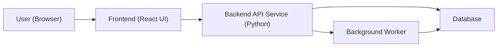
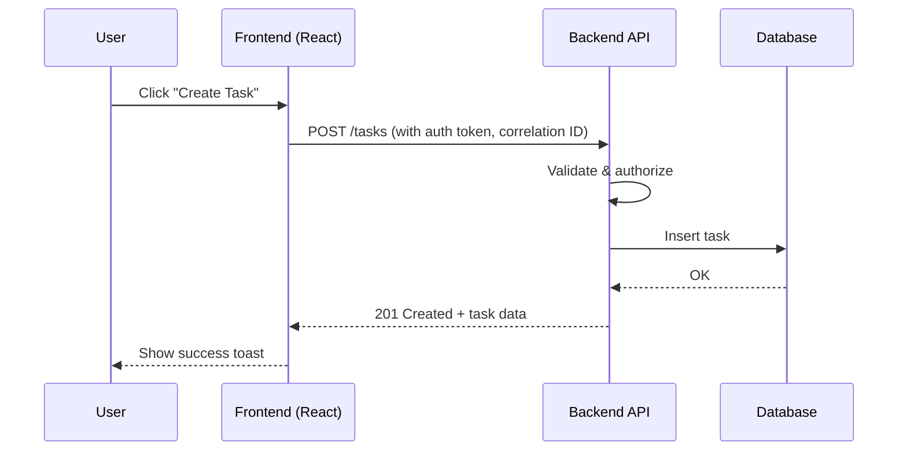
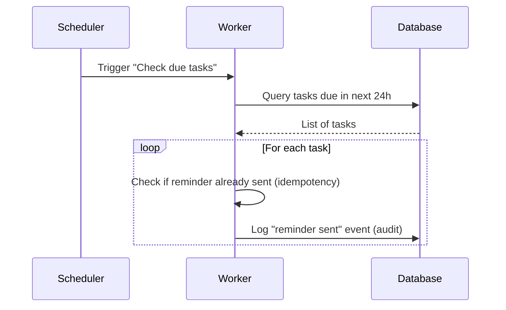

## Architecture – Task Tracker

This document describes the planned architecture for the Task Tracker application, based on:
- The assignment in `docs/requirements.md`
- The structured view in `docs/technical-specs.md`

Where this document goes beyond those files, items are clearly marked as **Design Choice**.

---

## 1. Context & Goals

- Full‑stack Task Tracker application where users:
  - Log in.
  - Create, view, edit, delete tasks.
  - Attach files.
  - Receive reminders for tasks due in the next 24 hours.
  - Monitor their activity.
- System must provide:
  - Backend service.
  - Front‑end.
  - Basic observability (logging, metrics, health checks).
- Non‑functional expectations:
  - Clean Architecture, maintainable code, clear design decisions.
  - AI‑assisted development (Cursor, Copilot, Claude, etc.).

---

## 2. High‑Level System Components

From the requirements, the system will contain at least:

- **Frontend (React UI)**:
  - Handles login and task management.
  - Provides views for:
    - Task list.
    - Task detail.
    - Create/edit task.
    - Attachments section.
  - Displays:
    - Client‑side validation errors.
    - Toasts/alerts for success and failure.
  - Exposes change‑password functionality.

- **Backend API service (Python)**:
  - Exposes endpoints for:
    - Secure login (OIDC/OAuth2 or JWT‑based).
    - Task management (CRUD with required fields).
    - Attachments (upload, list, delete).
    - Search, filtering, sorting, pagination of tasks.
    - Change password.
  - Enforces:
    - “User can modify only their own data, but can view all records.”
    - Per‑user or per‑IP rate limiting.
  - Provides:
    - Structured logging with correlation IDs.
    - Basic metrics (request count, error rate, latency, reminders processed).
    - Health check endpoints (API, database, worker).
  - Implements centralized exception handling and consistent error responses.

- **Background worker / service**:
  - Periodically checks for tasks due in the next 24 hours.
  - Logs “reminder sent” events.
  - Is idempotent and fault‑tolerant (no duplicate reminders).
  - Retries failed jobs and handles restarts gracefully.

- **Database**:
  - Stores:
    - Users.
    - Tasks with their fields (title, description, status, priority, due date, tags).
    - Attachments metadata (at least name and size, plus any storage reference as a design choice).
    - Audit trail events (task creation, update, attachment added/removed, reminder sent) with timestamps and user IDs.

> **Design Choice**: Exact database technology, schema details, and attachment storage mechanism are not specified in the requirements and can be selected to fit the stack and time constraints.

---

## 3. Logical Layering (Clean Architecture)

To align with the requirement for Clean Architecture, the backend will be organized into logical layers:

- **Domain layer**:
  - Contains core business concepts and rules for:
    - Users.
    - Tasks.
    - Attachments.
    - Audit events.
    - Reminder logic.

- **Application layer (use‑cases)**:
  - Coordinates operations such as:
    - Creating, viewing, updating, deleting tasks.
    - Managing attachments for tasks.
    - Searching and filtering tasks.
    - Running reminder checks and logging “reminder sent” events.
  - Depends on interfaces for persistence, messaging, and external services.

- **Infrastructure layer**:
  - Implements:
    - Data access (database).
    - Attachment storage.
    - Logging, metrics, rate limiting.
    - Background job scheduling and execution.

- **Interface / presentation layer**:
  - Backend HTTP API controllers/routers.
  - Worker entry points.
  - Frontend React components.

> **Design Choice**: The exact folder/module layout and naming inside these layers are not prescribed by the requirements and can follow common Clean Architecture patterns.

---

## 4. Cross‑Cutting Concerns

These concerns apply across multiple components:

- **Authentication & Authorization**:
  - Modern authentication using OIDC/OAuth2 or JWT.
  - Authorization rules to ensure users modify only their own data.

- **Rate Limiting**:
  - Basic per‑user or per‑IP limits applied at the API boundary.
  - Meaningful error responses when limits are exceeded.

- **Logging & Correlation IDs**:
  - Structured logs with a correlation ID generated or propagated per request.
  - Correlation ID propagated into worker operations where applicable.

- **Metrics & Health Checks**:
  - Metrics for:
    - Request count.
    - Error rate.
    - Latency.
    - Reminders processed.
  - Health endpoints to verify:
    - API is reachable.
    - Database connectivity.
    - Worker/queue is operational.

- **Error Handling & Resilience**:
  - Centralized exception handling in the API.
  - Consistent error response shape (as a design choice).
  - Worker retry and restart strategies to avoid duplicate reminders.

> **Design Choice**: The specific logging/metrics libraries, rate limiting strategy, and retry mechanisms are not fixed by the requirements and can be chosen based on familiarity and ecosystem support.

---

## 5. Test Strategy (Per Requirements)

The architecture must support the following test types:

- **Unit tests**:
  - Focused on individual functions, classes, and domain rules.

- **Integration tests (API + DB)**:
  - Exercise API endpoints together with the database.

- **Worker/queue tests**:
  - Cover reminder scheduling/processing and idempotency behavior.

- **Contract/API documentation tests**:
  - Ensure that the implemented API matches the Swagger/OpenAPI documentation.

- **Observability/health checks tests**:
  - Validate health endpoints and presence of basic metrics.

- **UI smoke tests**:
  - Verify that key flows (login, task list, basic CRUD) work end‑to‑end.

> **Design Choice**: Choice of test frameworks and test organization is left open by the requirements.

---

## 6. Summary

This architecture description:
- Stays within the scope defined by `docs/requirements.md` and `docs/technical-specs.md`.
- Highlights where concrete implementation decisions are required but not mandated.
- Provides enough structure to implement the backend, worker, and frontend while preserving flexibility for technology and detailed design choices.

---

## 7. Architecture Charts (Text Diagrams)

The following diagrams give a visual overview of the system. They are descriptive only and do not add new requirements.

### 7.1 High‑Level Components

### 7.2 Request & Logging Flow (Example)

### 7.3 Reminder Worker Flow (Example)

